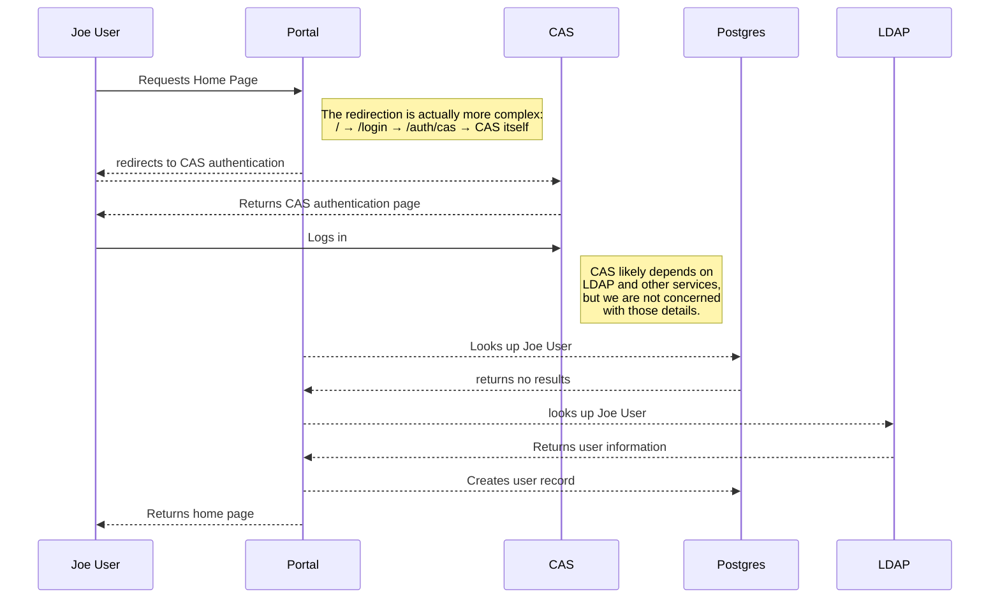
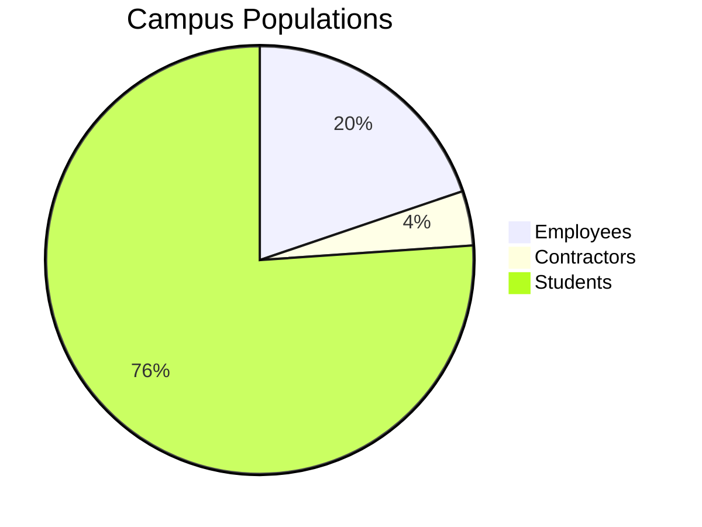

Mermaid Experiments
===================

Experimenting with Mermaid diagrams for documentation


New User Log-In
---------------





Visualizing Statistics
----------------------





Cron Jobs
---------

It doesn't look like Gantt charts will work for visualizing cron jobs, yet.  They apparently can't use anything other than specific dates.  

```mermaid
gantt
dateFormat HH:MM
section UC Path
6AM Update   :done,    job6am, 6AM,1m
9AM Update   :done,    job9am, after job6am,1m
section Blazer
Parallel 1   :         job6pm, after job9am, 1m
Parallel 2   :         des4, 6AM Update, 1m
%% Parallel 3   :         des5, after des3, 1m
%% Parallel 4   :         des6, after des4, 1m
section Reports
Parallel 1   :         job6pm, after job9am, 1m
Parallel 2   :         des4, 6AM Update, 1m

```
