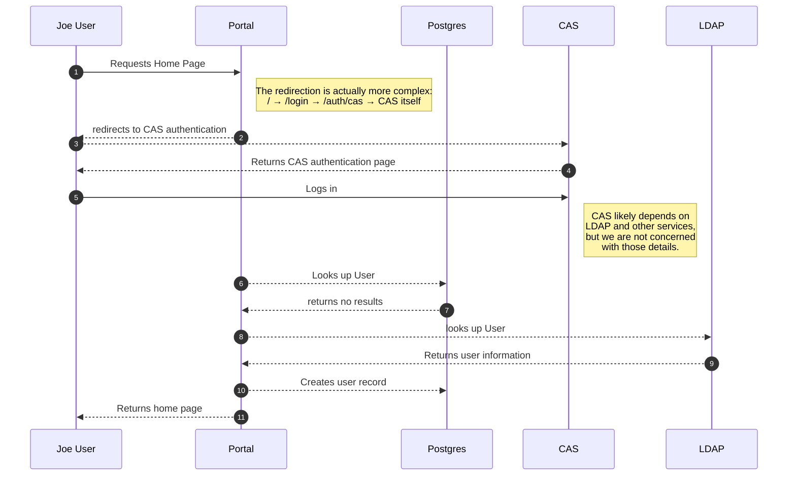
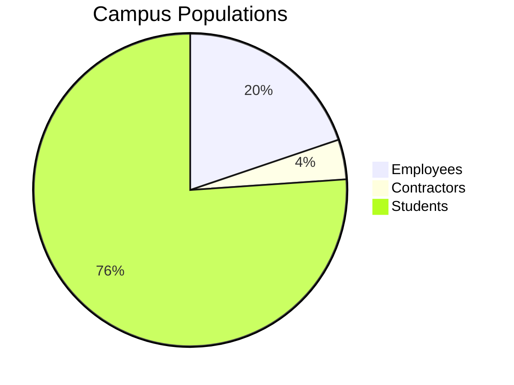

Mermaid Experiments
===================

Experimenting with Mermaid diagrams for documentation

New User Log-In
---------------

Visualizing Statistics
----------------------

Cron Jobs
---------

It looks like Gantt charts will work for visualizing cron jobs, although they're not perfectly suited to the job.

```mermaid
gantt
title Portal Cron Schedule

dateFormat HH:mm
axisFormat %H:%M
%%todayMarker stroke-width:5px,stroke:#0f0,opacity:0.5
todayMarker off

%%2 AM     : milestone, h2, 02:00, 1min

%%4 AM     : milestone, h4, 04:00, 1sec
%%5 AM     : milestone, h5, 05:00, 2sec
%%6 AM     : milestone, h6, 06:00, 1sec
%%9 AM     : milestone, h9, 09:00, 1sec


section Hourly
Data Lake Updates @ 17 :done, data_lake_updates_17, 00:17, 3min
Data Lake Updates @ 47 :done, data_lake_updates_47, 00:47, 3min
click data_lake_updates_17 call alert("Data Lake Updates occur hourly @ 17 minutes after the hour")
click data_lake_updates_17 call alert("Data Lake Updates occur hourly @ 47 minutes after the hour")


section Daily
Midnight: milestone,        h0, 00:00, 1min
Expired Screener Deletion:  expired_screener_deletion, 00:12, 1min
Essential Access Update:    essential_access_update, 00:15, 35min
Reset Badge Data:           reset_badge_data, 00:20, 1min
4-30 AM: milestone,         h4-30, 04:30, 0min
Org Unit Update:            org_unit_update, 04:30, 15min
6 AM: milestone,            h6, 06:00, 0sec
Student Flu Policy Report:  student_flu_policy_report, 06:00, 5min

6 AM UC Path Update 		: 6_am_uc_path_update,     06:00, 45min
9 AM UC Path Update 		: 9_am_uc_path_update,     09:00, 45min
6 PM Deletion Scan 		: 6_pm_deletion_scan, 18:00, 190min


section Monday
3-15 AM     : milestone, h3-15, 03:15, 0sec
Metrics Report :done, metrics_report, 03:15, 5min
Duplicate ID report :done, duplicate_id_report, 06:00, 5min


section Tuesday
UHS Campus Badge Report :done, uhs_campus_badge_report, 12:00, 10min


section Saturday
2 PM UC Path Complete 		: 2_pm_uc_path_complete, 14:00, 360min
Essential Access Complete	: essential_access_coplete, 19:00, 135min
Complete Data Lake Update :done, complete_data_lake_update, 07:05, 35min
Inactivate Historical Jobs :done, inactivate_historical_jobs, 03:10, 150min


section Monthly
Send Expiration Reports : send_expiration_reports, 10:45, 25min


```

